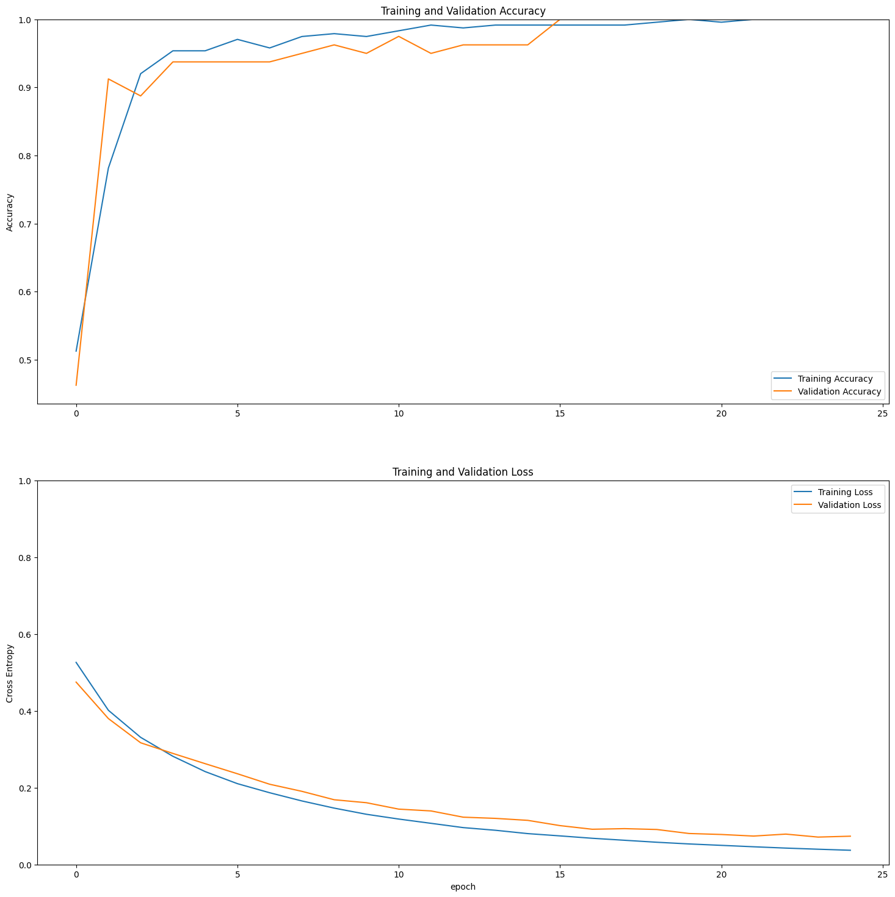

# Projeto Final - Modelos Preditivos Conexionistas

### Rafael George de Moraes Cruz

|**Tipo de Projeto**|**Modelo Selecionado**|**Linguagem**|
|--|--|--|
|Classificação de Imagens|ex.: MobileNetV2|Tensorflow|

## Performance

O modelo treinado possui performance de **99.9%**.

### Output do bloco de treinamento

<details>
  <summary>Click to expand!</summary>
  
  ```text
Epoch 1/25
16/16 [==============================] - ETA: 0s - loss: 0.5261 - accuracy: 0.5126
Epoch 1: saving model to training_1/cp.ckpt
16/16 [==============================] - 15s 443ms/step - loss: 0.5261 - accuracy: 0.5126 - val_loss: 0.4748 - val_accuracy: 0.4625
Epoch 2/25
16/16 [==============================] - ETA: 0s - loss: 0.4015 - accuracy: 0.7815
Epoch 2: saving model to training_1/cp.ckpt
16/16 [==============================] - 9s 298ms/step - loss: 0.4015 - accuracy: 0.7815 - val_loss: 0.3799 - val_accuracy: 0.9125
Epoch 3/25
16/16 [==============================] - ETA: 0s - loss: 0.3310 - accuracy: 0.9202
Epoch 3: saving model to training_1/cp.ckpt
16/16 [==============================] - 6s 284ms/step - loss: 0.3310 - accuracy: 0.9202 - val_loss: 0.3169 - val_accuracy: 0.8875
Epoch 4/25
16/16 [==============================] - ETA: 0s - loss: 0.2817 - accuracy: 0.9538
Epoch 4: saving model to training_1/cp.ckpt
16/16 [==============================] - 6s 272ms/step - loss: 0.2817 - accuracy: 0.9538 - val_loss: 0.2892 - val_accuracy: 0.9375
Epoch 5/25
16/16 [==============================] - ETA: 0s - loss: 0.2419 - accuracy: 0.9538
Epoch 5: saving model to training_1/cp.ckpt
16/16 [==============================] - 5s 256ms/step - loss: 0.2419 - accuracy: 0.9538 - val_loss: 0.2625 - val_accuracy: 0.9375
Epoch 6/25
16/16 [==============================] - ETA: 0s - loss: 0.2105 - accuracy: 0.9706
Epoch 6: saving model to training_1/cp.ckpt
16/16 [==============================] - 5s 269ms/step - loss: 0.2105 - accuracy: 0.9706 - val_loss: 0.2362 - val_accuracy: 0.9375
Epoch 7/25
16/16 [==============================] - ETA: 0s - loss: 0.1868 - accuracy: 0.9580
Epoch 7: saving model to training_1/cp.ckpt
16/16 [==============================] - 5s 245ms/step - loss: 0.1868 - accuracy: 0.9580 - val_loss: 0.2089 - val_accuracy: 0.9375
Epoch 8/25
16/16 [==============================] - ETA: 0s - loss: 0.1655 - accuracy: 0.9748
Epoch 8: saving model to training_1/cp.ckpt
16/16 [==============================] - 6s 241ms/step - loss: 0.1655 - accuracy: 0.9748 - val_loss: 0.1905 - val_accuracy: 0.9500
Epoch 9/25
16/16 [==============================] - ETA: 0s - loss: 0.1468 - accuracy: 0.9790
Epoch 9: saving model to training_1/cp.ckpt
16/16 [==============================] - 5s 270ms/step - loss: 0.1468 - accuracy: 0.9790 - val_loss: 0.1686 - val_accuracy: 0.9625
Epoch 10/25
16/16 [==============================] - ETA: 0s - loss: 0.1308 - accuracy: 0.9748
Epoch 10: saving model to training_1/cp.ckpt
16/16 [==============================] - 6s 295ms/step - loss: 0.1308 - accuracy: 0.9748 - val_loss: 0.1609 - val_accuracy: 0.9500
Epoch 11/25
16/16 [==============================] - ETA: 0s - loss: 0.1183 - accuracy: 0.9832
Epoch 11: saving model to training_1/cp.ckpt
16/16 [==============================] - 6s 284ms/step - loss: 0.1183 - accuracy: 0.9832 - val_loss: 0.1442 - val_accuracy: 0.9750
Epoch 12/25
16/16 [==============================] - ETA: 0s - loss: 0.1072 - accuracy: 0.9916
Epoch 12: saving model to training_1/cp.ckpt
16/16 [==============================] - 6s 266ms/step - loss: 0.1072 - accuracy: 0.9916 - val_loss: 0.1395 - val_accuracy: 0.9500
Epoch 13/25
16/16 [==============================] - ETA: 0s - loss: 0.0961 - accuracy: 0.9874
Epoch 13: saving model to training_1/cp.ckpt
16/16 [==============================] - 5s 241ms/step - loss: 0.0961 - accuracy: 0.9874 - val_loss: 0.1232 - val_accuracy: 0.9625
Epoch 14/25
16/16 [==============================] - ETA: 0s - loss: 0.0891 - accuracy: 0.9916
Epoch 14: saving model to training_1/cp.ckpt
16/16 [==============================] - 5s 268ms/step - loss: 0.0891 - accuracy: 0.9916 - val_loss: 0.1201 - val_accuracy: 0.9625
Epoch 15/25
16/16 [==============================] - ETA: 0s - loss: 0.0804 - accuracy: 0.9916
Epoch 15: saving model to training_1/cp.ckpt
16/16 [==============================] - 5s 241ms/step - loss: 0.0804 - accuracy: 0.9916 - val_loss: 0.1149 - val_accuracy: 0.9625
Epoch 16/25
16/16 [==============================] - ETA: 0s - loss: 0.0745 - accuracy: 0.9916
Epoch 16: saving model to training_1/cp.ckpt
16/16 [==============================] - 6s 286ms/step - loss: 0.0745 - accuracy: 0.9916 - val_loss: 0.1013 - val_accuracy: 1.0000
Epoch 17/25
16/16 [==============================] - ETA: 0s - loss: 0.0683 - accuracy: 0.9916
Epoch 17: saving model to training_1/cp.ckpt
16/16 [==============================] - 5s 270ms/step - loss: 0.0683 - accuracy: 0.9916 - val_loss: 0.0918 - val_accuracy: 1.0000
Epoch 18/25
16/16 [==============================] - ETA: 0s - loss: 0.0631 - accuracy: 0.9916
Epoch 18: saving model to training_1/cp.ckpt
16/16 [==============================] - 6s 286ms/step - loss: 0.0631 - accuracy: 0.9916 - val_loss: 0.0934 - val_accuracy: 1.0000
Epoch 19/25
16/16 [==============================] - ETA: 0s - loss: 0.0580 - accuracy: 0.9958
Epoch 19: saving model to training_1/cp.ckpt
16/16 [==============================] - 5s 275ms/step - loss: 0.0580 - accuracy: 0.9958 - val_loss: 0.0912 - val_accuracy: 1.0000
Epoch 20/25
16/16 [==============================] - ETA: 0s - loss: 0.0535 - accuracy: 1.0000
Epoch 20: saving model to training_1/cp.ckpt
16/16 [==============================] - 6s 236ms/step - loss: 0.0535 - accuracy: 1.0000 - val_loss: 0.0807 - val_accuracy: 1.0000
Epoch 21/25
16/16 [==============================] - ETA: 0s - loss: 0.0499 - accuracy: 0.9958
Epoch 21: saving model to training_1/cp.ckpt
16/16 [==============================] - 5s 275ms/step - loss: 0.0499 - accuracy: 0.9958 - val_loss: 0.0782 - val_accuracy: 1.0000
Epoch 22/25
16/16 [==============================] - ETA: 0s - loss: 0.0462 - accuracy: 1.0000
Epoch 22: saving model to training_1/cp.ckpt
16/16 [==============================] - 5s 260ms/step - loss: 0.0462 - accuracy: 1.0000 - val_loss: 0.0740 - val_accuracy: 1.0000
Epoch 23/25
16/16 [==============================] - ETA: 0s - loss: 0.0428 - accuracy: 1.0000
Epoch 23: saving model to training_1/cp.ckpt
16/16 [==============================] - 5s 276ms/step - loss: 0.0428 - accuracy: 1.0000 - val_loss: 0.0791 - val_accuracy: 1.0000
Epoch 24/25
16/16 [==============================] - ETA: 0s - loss: 0.0398 - accuracy: 1.0000
Epoch 24: saving model to training_1/cp.ckpt
16/16 [==============================] - 5s 281ms/step - loss: 0.0398 - accuracy: 1.0000 - val_loss: 0.0714 - val_accuracy: 1.0000
Epoch 25/25
16/16 [==============================] - ETA: 0s - loss: 0.0371 - accuracy: 1.0000
Epoch 25: saving model to training_1/cp.ckpt
16/16 [==============================] - 6s 272ms/step - loss: 0.0371 - accuracy: 1.0000 - val_loss: 0.0737 - val_accuracy: 1.0000
  ```
</details>

### Evidências do treinamento

  
  


## Roboflow

[Animais](https://universe.roboflow.com/cesar-kkubx/deep-learning-animals/dataset/2)

## HuggingFace

Nessa seção você deve publicar o link para o HuggingFace
